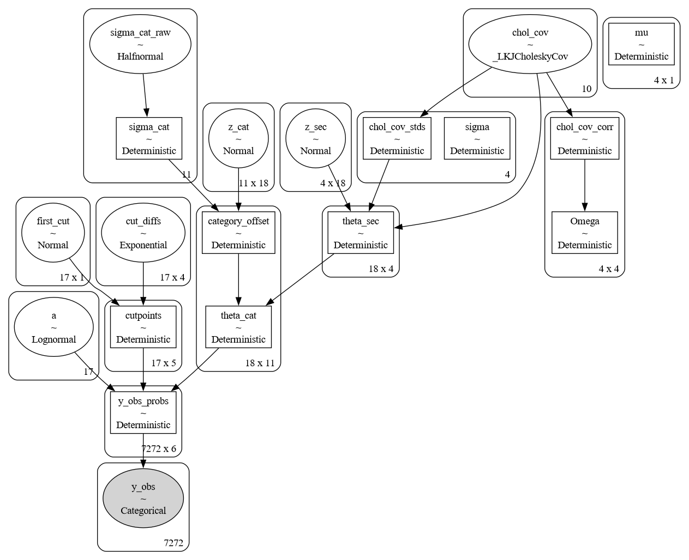
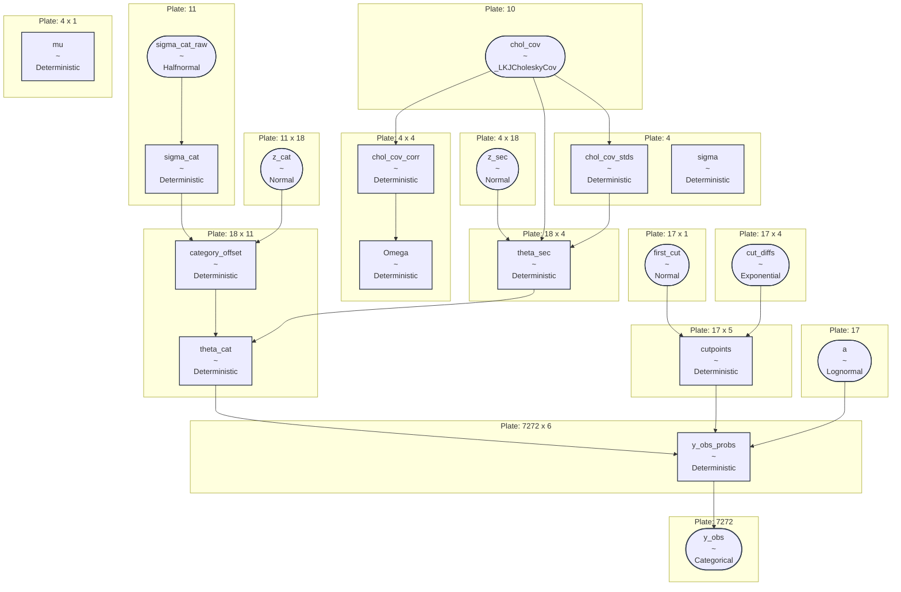

# dora survey analysis

| Node (Shape)                        | Prior / Transform / Type                                      | What it is about                                                                                                                                                                      | Why this is a reasonable hyperparameterization                                                                                                                                                                                          |
|:------------------------------------|:--------------------------------------------------------------|:--------------------------------------------------------------------------------------------------------------------------------------------------------------------------------------|:----------------------------------------------------------------------------------------------------------------------------------------------------------------------------------------------------------------------------------------|
| **`sigma_cat_raw`** *(oval)*        | `Halfnormal` (`#categories`)                                  | Raw latent standard deviations of the 11 Category capability offsets from their parent Sections.                                                                                      | Restricts variance to be strictly positive ($\ge 0$) and regularizes category-level deviations to prevent them from drifting excessively from their Section baselines.                                                                  |
| **`sigma_cat`** *(rectangle)*       | `Deterministic` (`#categories`)                               | Masked category deviation scale. It forces standard deviations of 1-question categories to be exactly `0.0`, while letting multi-question categories keep their estimated deviations. | **This is the core anchor that solves overparameterization.** It prevents 1-question categories from introducing unidentifiable variance parameters, keeping the model mathematically stable.                                           |
| **`z_cat`** *(oval)*                | `Normal` (`#categories` x `#teams_years`)                     | Unscaled, standard-normal latent offsets for the 11 categories across all 18 team-year groups.                                                                                        | Implements a **non-centered parameterization** of the hierarchical offsets. This decouples the latent offsets from their standard deviations, helping the NUTS sampler avoid geometry funnels and converge rapidly.                     |
| **`category_offset`** *(rectangle)* | `Deterministic` (`#teams_years` x `#categories`)              | The actual group-specific capability deviation of each team-year for each category.                                                                                                   | Re-scales the standard normal `z_cat` offsets back to the correct category scale determined by `sigma_cat` via a simple multiplication (`z_cat * sigma_cat`).                                                                           |
| **`z_sec`** *(oval)*                | `Normal` (`#sections` x `#teams_years`)                       | Unscaled, independent latent traits for the 4 Sections across all 18 team-year groups.                                                                                                | Serves as the raw, uncorrelated parameter space for the section-level capabilities, allowing NUTS to sample easily before joint correlation is applied.                                                                                 |
| **`chol_cov`** *(oval)*             | `_LKJCholeskyCov` (triangle(`#sections`))                     | Cholesky factor of the covariance matrix for the 4 Sections, modeled with an LKJ prior ($\eta=2.0$).                                                                                  | LKJ with $\eta=2.0$ regularizes section-level correlations, moderately pulling off-diagonal correlations toward 0 to prevent extreme multicollinearity while allowing the model to learn structural relationships [1].                  |
| **`chol_cov_stds`** *(rectangle)*   | `Deterministic` (`#sections`)                                 | The standard deviation components unpacked from the section covariance.                                                                                                               | Automatically extracted by PyMC's `LKJCholeskyCov` API to split scale from correlation.                                                                                                                                                 |
| **`chol_cov_corr`** *(rectangle)*   | `Deterministic` (`#sections` x `#sections`)                   | The raw correlation matrix components unpacked from the section covariance.                                                                                                           | Extracted to isolate the pure correlation relationships of the sections, separating out scale from dependency.                                                                                                                          |
| **`Omega`** *(rectangle)*           | `Deterministic` (`#sections` x `#sections`)                   | Human-readable latent correlation matrix of the 4 Sections.                                                                                                                           | Monitored so the post-hoc diagnostics can evaluate potential category/section redundancy warnings against the `HIGH_CORR_THRESHOLD` [1].                                                                                                |
| **`sigma`** *(rectangle)*           | `Deterministic` (`#sections`)                                 | Fixed constant vector of ones for the Section-level latent scale.                                                                                                                     | Satisfies downstream plotting dependencies in your pipeline without introducing unidentifiable scale variables into the actual sampler.                                                                                                 |
| **`mu`** *(rectangle)*              | `Deterministic` (`#sections` x 1)                             | Fixed constant vector of zeros for the Section-level latent location.                                                                                                                 | Satisfies downstream code requirements while anchoring the population mean to 0 to prevent location drift.                                                                                                                              |
| **`theta_sec`** *(rectangle)*       | `Deterministic` (`#teams_years` x `#sections`)                | Standardized, correlated latent Section capability scores for all team-year groups.                                                                                                   | Computed via `pt.dot(chol_corr, z_sec).T`. Because it uses the pure correlation Cholesky factor (`chol_corr`), the latent traits have a population variance of exactly 1.0, rendering them directly interpretable as Z-scores.          |
| **`theta_cat`** *(rectangle)*       | `Deterministic` (`#teams_years` x `#categories`)              | Team-year capability scores at the Category level.                                                                                                                                    | Combines the parent Section capabilities (`theta_sec`) with the Category-specific offsets. This forms the hierarchical bridge that allows modeling both macro-section and micro-category performance seamlessly.                        |
| **`first_cut`** *(oval)*            | `Normal` (`#questions` x 1)                                   | The latent location of the very first ordinal response threshold for each of the 17 questions.                                                                                        | Anchored slightly negative (mean -1.5) to naturally align the first response boundary of a 6-point scale across the standardized latent trait distribution.                                                                             |
| **`cut_diffs`** *(oval)*            | `Exponential` (`#questions` x (`#question_options` - 2))      | The distance/spacing between consecutive ordinal response boundaries.                                                                                                                 | The exponential prior restricts these gaps to be strictly positive ($>0$), which is a mathematical requirement to guarantee that the response thresholds (`cutpoints`) are monotonically ordered ($b_1 < b_2 < b_3...$).                |
| **`cutpoints`** *(rectangle)*       | `Deterministic` (`#questions` x (`#question_options` - 1))    | The 5 ordered latent thresholds ($b_k$) for each of the 17 questions.                                                                                                                 | Formed by taking `first_cut` and adding the cumulative sum of the positive step differences (`cut_diffs`), ensuring the ordinal category boundaries are strictly ordered.                                                               |
| **`a`** *(oval)*                    | `Lognormal` (`#questions`)                                    | Item discrimination parameters ($a$) for the 17 questions.                                                                                                                            | LogNormal restricts discrimination to be strictly positive, satisfying the psychometric monotonicity requirement (i.e. having a higher latent capability must *always* increase the probability of selecting a higher response option). |
| **`y_obs_probs`** *(rectangle)*     | `Deterministic` (`#observed_responses` x `#question_options`) | The calculated probability distribution over the 6 response options for all 7272 observations.                                                                                        | Computes the Graded Response Model likelihood formula using the item parameters (`a`, `cutpoints`) and group traits (`theta_cat`).                                                                                                      |
| **`y_obs`** *(shaded oval)*         | `Categorical` (`#observed_responses`)                         | The actual observed responses from the survey participants (7272 total data points).                                                                                                  | This is the raw data input node. Modeling it under an `OrderedLogistic` likelihood allows the model to update the latent priors with the true survey results.                                                                           |

> Note:
> `#observed_responses` is not exactly `#respondents * #questions`
> because of branching logic in the survey where different respondents answer a different subset of questions

---

notes from llm from long ago but the code is probably a better reference:

1. Capability Interpretation: Model scores (theta) and Z-scores represent relative team capabilities.
   Compare relative values across teams and focus on individual performance improvement. Standardized values
   represent performance deviations relative to the entire company population.
2. Focused Reorganizations: Linear transitions are mapped using slope charts. Track standard offsets
   to evaluate split/merged team performance relative to parent groups.
3. Item Validation: CRF, IIF, and empirical fit graphs provide item diagnostics. Identify low discrimination
   items (a < 0.3) for potential adjustment in future survey cycles.
4. Target precision mapping: The Test Information Function (TIF) maps region bounds where capability measurements
   are most precise (lowest SEM).
5. Compositional items (e.g., how time is spent) should not be averaged directly. Run separate evaluations
   to avoid bias.
6. Ensure that subjective capability ranks are regularly compared to objective delivery metrics to validate
   self-assessments.
